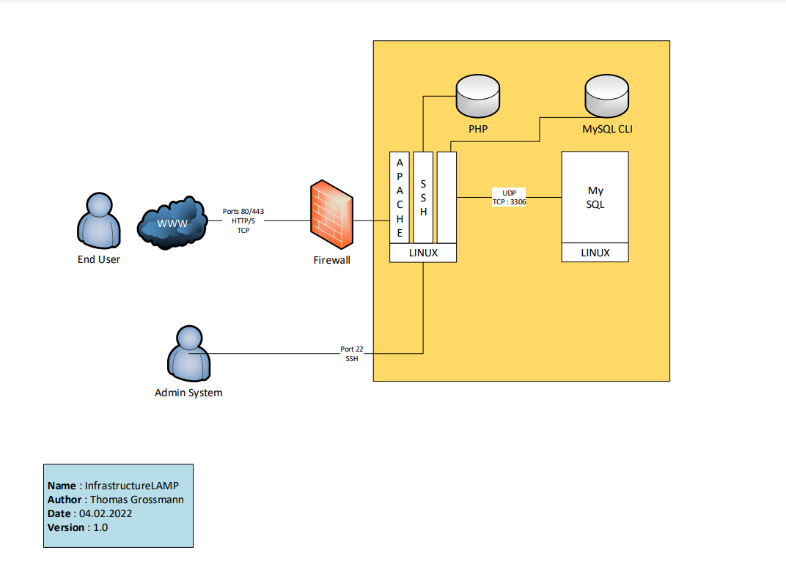

### Wiki ICT-239 Thomas Grossmann

### Schéma infrastructure :

###### Paramètres VMWare :
- Product : VMware® Workstation 16 Pro
- Version : 16.1.0 build-17198959

### Installation de Debian :
iso : debian-11.2.0-amd64-netinst

##### Paramètres
- Number of processors → 1
- Memory → 512 MB
- Network Connection → NAT
- Disk Size → Maximum disk size (in GB) → 20.0 G

##### Modifications Hardware
- Enlever → USB Controller
- Enlever → Sound Card
- Enlever → Printer
- New CD/DVD (IDE) → Use ISO image DEBIAN → Connecter CD/DVD

#### Vérification de l'intégrité de l'ISO Debian :
iso : debian-11.2.0-amd64-netinst
